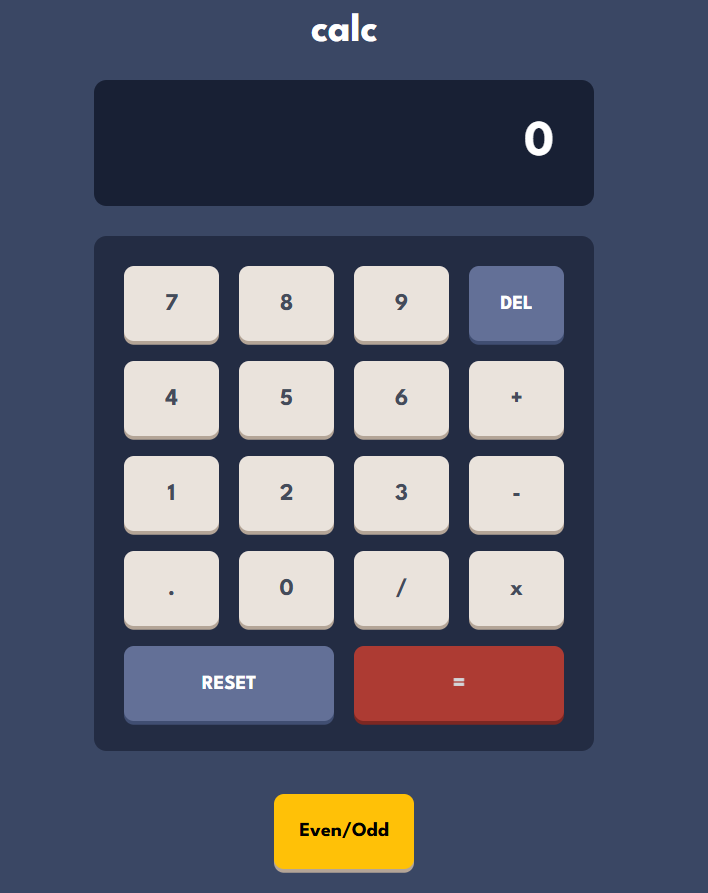

# 🧮 Calculator App

This is a simple, clean, and fully functional calculator built using **HTML**, **CSS Grid**, and **JavaScript**. It supports basic arithmetic operations and is responsive across different device sizes.

## 🚀 Live Demo

- 🌐 **Live Site URL**: [View it in action](https://calculator-webapp-mu.vercel.app/)
- 💻 **Solution URL**: [See the code](https://github.com/SanyaShresta25/Calculator-Webappp)

## 📸 Screenshot

## 📐 Built With

- ✅ Semantic **HTML5**
- 🎨 **CSS Grid** for layout structure
- 🖌️ **Custom properties** for theme flexibility
- 💡 **Vanilla JavaScript** for functionality
- 📱 Mobile-first responsive design

## ✨ Features

- Basic arithmetic operations: ➕ ➖ ✖️ ➗
- Responsive UI using CSS Grid layout
- Interactive button press feedback
- Clear, reset, and delete functionality
- Well-structured and beginner-friendly code

## 🧠 What I Learned

- Structuring UIs using **CSS Grid** over traditional Flexbox
- Handling button events using **event delegation**
- Managing dynamic screen input with **JavaScript DOM manipulation**
- Implementing a clear, reset, and delete logic without libraries

## 🔄 Continued Development

- Add keyboard support for input
- Implement dark/light theme toggle
- Add scientific calculator features (%, √, etc.)
- Improve accessibility (ARIA labels, focus states)

## 📚 Useful Resources

- [MDN Web Docs - Grid Layout](https://developer.mozilla.org/en-US/docs/Web/CSS/CSS_grid_layout)
- [JavaScript Event Delegation](https://davidwalsh.name/event-delegate)
- [Calculator UI Design Inspiration](https://dribbble.com/tags/calculator)

## 👩‍💻 Author

- **Portfolio** – [Sanya Shresta Jathanna](https://sanyashresta.netlify.app/)
- **GitHub** – [@SanyaShresta25](https://github.com/SanyaShresta25)
- **Frontend Mentor** – [@SanyaShresta25](https://www.frontendmentor.io/profile/SanyaShresta25)

## 🙏 Acknowledgments

- Inspired by the [Frontend Mentor Calculator App Challenge](https://www.frontendmentor.io/challenges/calculator-app-9lteq5N29)
- Thanks to the dev community for helpful tutorials and grid layout tips!

